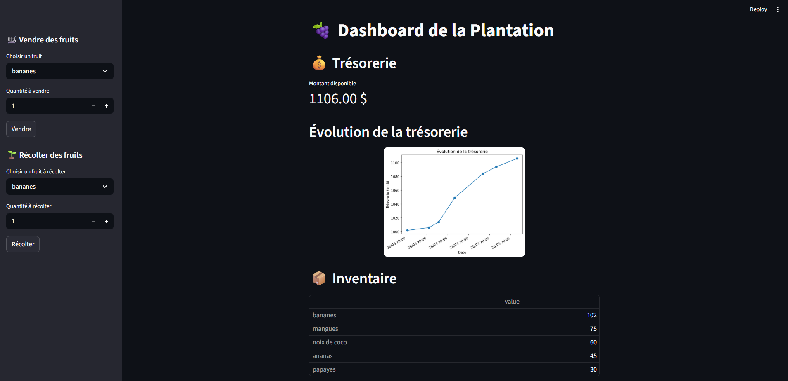

# 🍇 ​Fruit manager

Bienvenue sur **Fruit Manager**, un tableau de bord interactif pour gérer votre plantation de fruits ! Ce projet, développé avec Streamlit, vous permet de suivre votre inventaire, vendre et récolter des fruits tout en surveillant votre trésorerie en temps réel.

## 📊 Aperçu de l’application

Voici un aperçu du tableau de bord de l’application Streamlit :



## 🎯 Objectif du projet
Simuler une petite application de gestion d’inventaire avec suivi dynamique des stocks et de la trésorerie.

## 🛠️​ Installation

Création de l'environnement virtuel :
```bash
poetry install
```

Lancez le projet avec poetry :
```bash
poetry run streamlit run app.py
```

## 🚀​ Fonctionnalité

- **Vente de fruits** : Sélectionnez un fruit, indiquez la quantité à vendre et mettez à jour votre trésorerie automatiquement.

- **Récolte** : Ajoutez facilement de nouveaux fruits à votre inventaire après chaque récolte.

- **Suivi de la trésorerie** : Visualisez le montant disponible après chaque opération.

## ​📂​ Structure du projet

- `app.py` : Interface principale Streamlit.
- `fruit_manager.py` : Fonctions de gestion de l'inventaire, des ventes, des récoltes et de la trésorerie.
- `data/` : Fichier de données (inventaire, prix du marché, trésorerie).

## ​✨​ Exemple d'utilisation

- Accédez à l'interface web générée par Streamlit.
- Utilisez la barre latérale pour vendre ou récolter des fruits.
- Consultez l'inventaire et la trésorerie mis à jour en temps réel.

## ​🤝​ Contribuer

Les contributions sont les bienvenues !
N'hésitez pas à ouvrir une issue ou une pull request pour proposer des améliorations.

---

**Bonnes récoltes et bonnes ventes !**
🍌​🍍​🥭​​🥥​